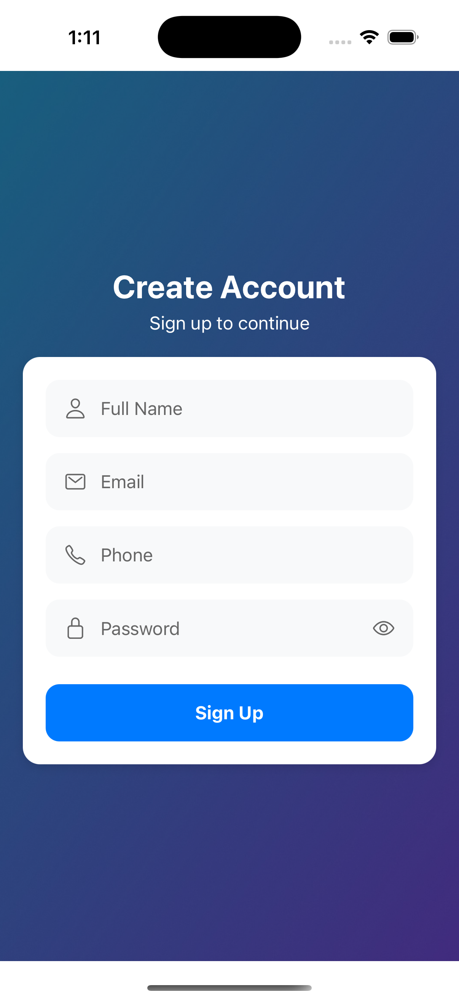
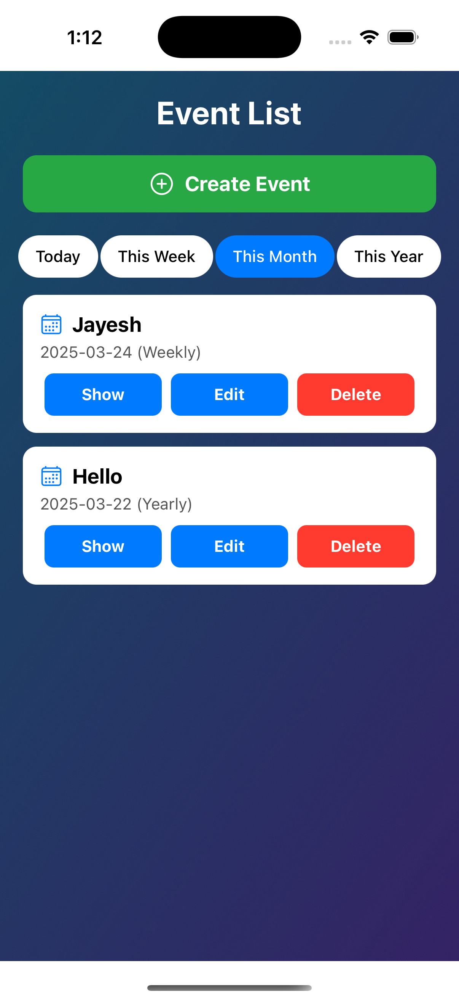
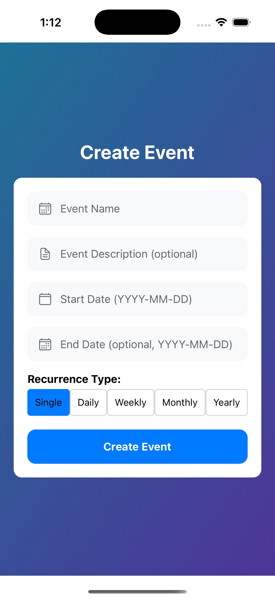
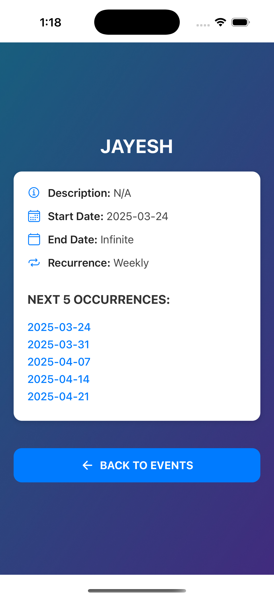

### **📌 Event Planner – React Native App**  

A **event management app** that allows users to create, edit, view, and delete events with recurrence options. The app includes local storage, validation, and a modern UI.

---

## **📋 Features**  

✅ **User Registration** – Sign up with **name, email, phone, and password**  
✅ **Event List** – View **all created events** with filter options (**Today, This Week, This Month, This Year**)  
✅ **Create & Edit Events** – Add **new events** and update existing ones  
✅ **Event Details** – Displays **name, date, recurrence type, and upcoming occurrences**  
✅ **Delete Events** – Remove events with **confirmation prompts**  
✅ **Local Storage with AsyncStorage** – Data **persists even after app restarts**  
✅ **Formik & Yup Validation** – Ensures proper **event and user input validation**  
✅ **React Navigation** – **Seamless screen transitions**  
✅ **Modern UI Design** – Clean, user-friendly, and responsive  

---

## **🛠️ Tech Stack**  

- **React Native** – Core framework  
- **TypeScript** – Type safety  
- **AsyncStorage** – Local storage for event persistence  
- **React Navigation** – Screen-to-screen navigation  
- **Formik + Yup** – Form handling & validation  
- **Moment.js** – Date formatting & recurrence calculations  
- **React Native Vector Icons** – Used for **better UI/UX**  

---

## **🚀 Installation & Setup**  

### **1️⃣ Clone the Repository**  
```sh
git clone https://github.com/Jayeshkushwaha/EventPlanner.git
cd EventPlanner
```

### **2️⃣ Install Dependencies**  
```sh
npm install
# OR
yarn install
```

### **3️⃣ Run the Project**  

📱 **For Android:**  
```sh
npx react-native run-android
```

🍏 **For iOS:**  
```sh
cd ios
pod install
cd ..
npx react-native run-ios
```

---

## **📱 Screenshots**  

### 🏠 Registration Screen  
  

### 📋 Event List  
  

### ➕ Create Event  
  

### 📄 Event Details  
  

---

## **👨‍💻 Author**  

**Jayesh Kushwaha** – React Native Developer 🚀  

**GitHub:** https://github.com/Jayeshkushwaha
**LinkedIn:** [linkedin.com/in/jayesh-kushwaha](https://www.linkedin.com/in/jayesh-kushwaha/)